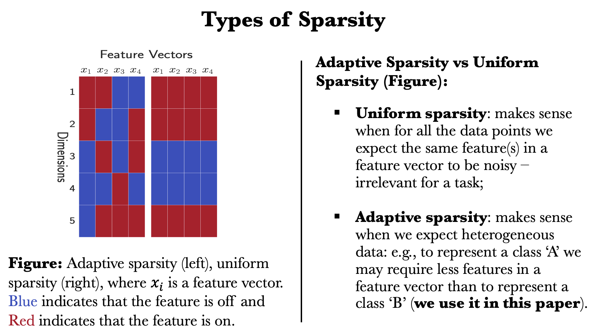

# [Hierarchical Sparse Variation Autoencoder (HSVAE)](https://aclanthology.org/2021.repl4nlp-1.5.pdf)
This repository contains an implementation of HSVAE model presented in the "Learning Sparse Sentence Encoding without Supervision: An Exploration of Sparsity in Variational Autoencoders" paper.

## Table of contents
1. [Types of Sparsity](#types-of-sparsity)
2. [Model](#model)
3. [Usage](#usage)
4. [Citing](#citing)
5. [Licence](#licence)
6. [Contact info](#contact-info)

## Types of Sparsity
In this paper we explore adaptive (a.k.a [ephemeral](https://htor.inf.ethz.ch/publications/index.php?pub=407)) sparsity:

## Model


## Usage
To train a new model:
```
python3 hsvae.py --z_reg_weight 0.01 --gamma_reg_weight 0.01 --temperature 0.5  --alpha 4  --beta 1 --iter 1
```
--z_reg_weight is the weight of the second term of the ELBO <br />
--gamma_reg_weight is the weight of the third term of the ELBO <br />
Adjust --alpha and --beta to achive the desired level of sparsity. Consult the paper for more information.

## Citing

If you find this material useful in your research, please cite:

```
@inproceedings{prokhorov2020hierarchical,
 title = "Learning Sparse Sentence Encoding without Supervision: An Exploration of Sparsity in Variational Autoencoders",
    author = "Prokhorov, Victor  and
      Li, Yingzhen  and
      Shareghi, Ehsan  and
      Collier, Nigel",
    booktitle = "Proceedings of the 6th Workshop on Representation Learning for NLP (RepL4NLP-2021)",
    month = aug,
    year = "2021",
    address = "Online",
    publisher = "Association for Computational Linguistics",
    url = "https://aclanthology.org/2021.repl4nlp-1.5",
    doi = "10.18653/v1/2021.repl4nlp-1.5",
    pages = "34--46"    
}
```

## Licence

The code in this repository is free software: you can redistribute it and/or modify it under the terms of the GNU General Public License version 3 as published by the Free Software Foundation. The code is distributed in the hope that it will be useful, but WITHOUT ANY WARRANTY; without even the implied warranty of MERCHANTABILITY or FITNESS FOR A PARTICULAR PURPOSE.  See the [GNU General Public License](https://www.gnu.org/licenses/gpl-3.0.en.html) for more details.


## Contact info

For questions or more information please use the following:
* **Email:** vp361@cam.ac.uk 
